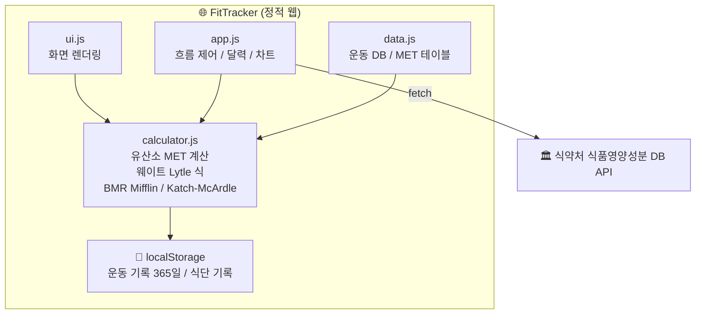

# FitTracker — 운동 · 식단 · 칼로리 밸런스 관리 웹 서비스

> 연구 기반 공식과 공공 API를 활용한 개인 맞춤형 건강 관리 서비스

🔗 **배포 링크**: https://bit.ly/4uTqgP6 
📱 **PWA 지원**: 모바일 홈 화면에 앱으로 설치 가능

---

## 프로젝트 소개

기존 운동 앱들은 "낮음 / 보통 / 높음" 같은 주관적 선택지로 칼로리를 추정합니다. 이 방식에 의문을 가져, **실제 수행 데이터(속도·중량·세트·반복수)** 와 **개인 신체 정보** 를 기반으로 스포츠 과학 연구 공식을 적용한 서비스를 직접 기획·개발했습니다.

운동 소모 칼로리만 계산하는 것을 넘어, 식단 기록과 결합해 하루 전체의 에너지 수지를 시각화하고 체중 방향까지 제시합니다.

**기획 → 설계 → 구현 → 배포** 전 과정을 1인 개발로 진행하였으며, AI 도구를 활용한 개발 협업 방식으로 빠른 이터레이션을 실현했습니다.

---

## 기술 스택

| 분류 | 기술 |
|------|------|
| **Frontend** | HTML5, CSS3, Vanilla JavaScript |
| **데이터 시각화** | Chart.js 4.4 |
| **데이터 저장** | localStorage (별도 서버 없음) |
| **외부 API** | 식품의약품안전처 식품영양성분DB (공공데이터포털) |
| **배포** | GitHub Pages |
| **앱화** | PWA (Service Worker, Web App Manifest) |
| **버전 관리** | Git / GitHub |

> 프레임워크 없이 Vanilla JS로 구현하여 웹 표준과 브라우저 동작 원리에 대한 이해를 높였습니다.

---

## 아키텍처

---

## 주요 기능

### 🏃 유산소 운동 칼로리 계산
- MET(Compendium of Physical Activities, 2011) 기반 계산
- **속도 입력** 또는 **걸음 수 입력** 두 가지 모드 지원
- 경사도 보정, 손잡이 사용 시간 보정(최대 10% 하향)
- 8km/h 이상 자동 달리기 MET 전환

### 🏋️ 웨이트 운동 칼로리 계산
- Lytle & Lambert(2019) 회귀방정식 적용 (R²=0.773)
- 볼륨(중량×반복수) 기반 운동별 기여도 분배
- 체지방 입력 시 **정밀 모드**, 미입력 시 **추정 모드** 자동 전환
- 어시스트 머신 실제 부하 역산 처리

### 📊 신체 지표 분석
- BMI 게이지 바 시각화
- BMR 이중 공식 자동 전환
  - 체지방 미입력 → **Mifflin-St Jeor**
  - 체지방 입력 → **Katch-McArdle** (체성분 반영, 더 정밀)
- 골격근량 기반 단백질 권장량 계산 (골격근량 × 2.0g)

### 🥗 식단 기록 및 영양소 추적
- 식약처 식품영양성분DB API 연동 (100건 검색, 브랜드별 그룹화)
- 음식 선택 시 탄수화물·단백질·지방 자동 입력
- 하루 권장량 대비 섭취 비율 막대 시각화

### 📅 기록 관리 및 시각화
- 월별 달력: 🟢 운동 / 🟣 식단 / 그라데이션 = 둘 다
- 최근 2주 칼로리 추이 차트 (운동 소모 · 식단 섭취 · 순밸런스)
- 체중 방향 표시: 감소 / 유지 / 증가

---

## 기여도 및 역할

**1인 개발 프로젝트** — 전 과정 단독 수행

| 단계 | 내용 |
|------|------|
| 기획 | 문제 정의, 기능 목록 설계, 우선순위 결정 |
| 설계 | 계산 공식 조사 및 검증, 데이터 구조 설계, UI/UX 설계 |
| 구현 | 유산소/웨이트 계산 엔진, 공공 API 연동, 달력/차트, PWA |
| 테스트 | 기능별 수동 테스트, 엣지케이스 처리, UTC 시간대 버그 발견 및 수정 |
| 배포 | GitHub Pages 배포, bit.ly 단축 링크 |

---

## 결과 및 성과

- **공공 API 연동**: 식약처 식품영양성분DB 100건 실시간 검색 구현
- **연구 기반 계산**: 단순 추정 대신 MET, Lytle 회귀식, Katch-McArdle 등 검증된 공식 적용
- **PWA 배포**: 별도 앱 스토어 없이 모바일 홈 화면 설치 가능
- **UTC 시간대 버그 발견 및 해결**: `toISOString()` UTC 오차를 로컬 날짜 함수로 수정
- **백엔드 없는 풀스택 경험**: 서버 없이 API 연동·데이터 저장·배포까지 완성

---

## 개발하면서 배운 점 및 문제 해결

**1. UTC 시간대 버그**  
`new Date().toISOString()`이 UTC 기준이라 한국(UTC+9) 새벽에는 전날 날짜가 반환되는 문제 발견. 로컬 날짜 기준 헬퍼 함수(`getTodayLocal()`)를 만들어 해결.

**2. 공공 API CORS 이슈**  
로컬(`file://`) 환경에서는 CORS 정책으로 API 호출 불가. GitHub Pages(`https://`) 환경에서 정상 동작하는 것을 확인하고 배포 환경에서 테스트하는 방식으로 전환.

**3. 칼로리 필드 매핑 오류**  
식약처 API의 `AMT_NUM13`이 나트륨이 아닌 칼로리일 것이라는 잘못된 가정. 공식 출력 메시지 엑셀 문서를 확인해 `AMT_NUM1`이 에너지(kcal)임을 파악하고 수정.

---

## 향후 개선 방향

- 사용자 계정 연동으로 기기 간 데이터 동기화
- 음식 카테고리 필터 기능 고도화
- 운동 루틴 저장 및 재사용 기능
- 주간/월간 통계 리포트 생성

---

## 계산 공식 출처

| 항목 | 공식 / 출처 |
|------|------------|
| 유산소 | Ainsworth et al., *Compendium of Physical Activities* (2011) |
| 웨이트 | Lytle & Lambert (2019), R²=0.773, SEE=28.5 kcal |
| BMR 기본 | Mifflin-St Jeor 공식 |
| BMR 정밀 | Katch-McArdle 공식 |
| 적정 체중 | 브로카 변법 |
| 체지방 추정 | Deurenberg 공식 |

> ⚠️ 본 서비스의 칼로리 값은 참고용 추정치이며 의료적 측정치가 아닙니다.
>
> - 개인의 생리적 특성, 운동 수행 방식, 체력 수준에 따라 실제 소모 칼로리와 차이가 있을 수 있습니다.
> - 웨이트 운동 수치는 Lytle 회귀식과 내부 보정계수를 함께 사용하며, 세션 총 추정치를 상대 기여도로 분배한 값입니다.
> - 런닝머신 등 기기 표시 칼로리와 차이가 발생할 수 있습니다. 기기마다 계산 방식이 표준화되어 있지 않습니다.
> - 식품 검색 결과의 영양소 값은 식약처 DB 기준이며, 조리 방법·브랜드에 따라 실제와 차이가 있을 수 있습니다.
